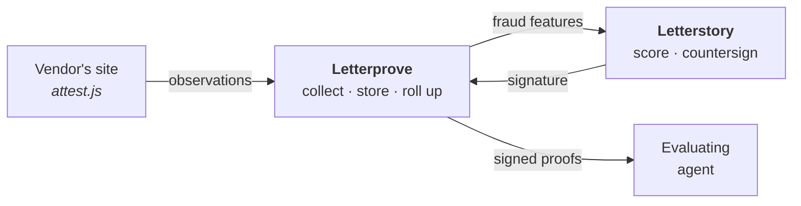
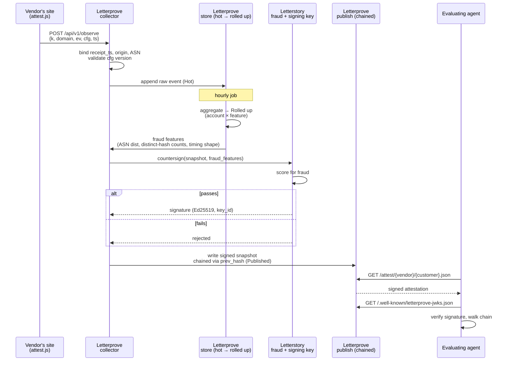

<div align="center">

<picture>
  <source media="(prefers-color-scheme: dark)" srcset="assets/logo-dark.svg">
  
</picture>

<br>

**Attested proof for AI agents.** &nbsp;·&nbsp; The "EEAT" for AEO.

</div>

---

A human evaluating software might skim three tabs. An agent evaluates thirty
products, reads every claim, checks every source, and discounts for vendor bias.
Discovery gets a product on the shortlist. **Proof gets it picked.**

Letterprove turns a vendor's logo wall — a page of unverifiable claims — into
signed, machine-readable attestations that an agent can fetch, verify, and cite.

<!-- STATUS:AUTO:START — generated by scripts/gen-readme-status.mjs, do not hand-edit below -->
> **Build status** — regenerated from the code, not hand-maintained. Run `node scripts/gen-readme-status.mjs` after a change that should move a row; `npm test` fails if this block drifts from what the checks find.

| | |
|---|---|
| ✅ Signing, chaining, proof endpoints, verifier | scripts/verify.mjs independently re-verifies signatures against fixture and live data |
| ✅ Collection (script → collector → rollups) | src/app/api/v1/observe/route.ts records real events into hot_rollups |
| ✅ Collection refuses unverified vendors | observe/route.ts checks vendor.domainVerified before recording anything |
| ✅ Every vendor row is created with a domain-verification token | domain_verification_token has a DB default, so create_vendor gets one without asking — the self-serve signup form this once described was retired with the local dashboard |
| ⬜ Fraud features (ASN distribution, hash counts) | fraud-features.ts still hardcodes these null — accepted gap, not wired to real ASN data yet |
| ✅ Tier 3 — Stripe corroboration | lib/stripe/sync.ts joins settled invoices to observed domains and writes vendor_payment_evidence; a subscription with no invoice that actually settled is not evidence, and a TEST-mode key stores nothing |
| ✅ Tier 4 — customer counter-signing | attest/[vendor]/[customer]/consent is the page the customer opens; approving sets countersigned_at, which earned() treats as tier-4 proof |
| ✅ Counter-signature is bound to the customer's own domain | consent-recipient.ts forces the link to an address on the customer's domain, and the vendor never receives the token |
| ✅ Publication is opt-in — a vendor is private until someone publishes it | findPublishedVendor() is the gated resolver every public route goes through; collection, freeze and signing still run while private, so publishing is a flip rather than a rebuild |
| ✅ Support / help infrastructure | the submit_support_request tool posts through lib/support/slack.ts to a Slack incoming webhook |
<!-- STATUS:AUTO:END -->

Every decision is tagged **Decided**, **Proposed**, or **Open**.

---

## The problem

Every logo on a vendor's marketing site is an unverified claim. So is every
testimonial, every case-study PDF, and every "trusted by 500 teams." A human
discounts them automatically. An agent does too — and unlike the human, it will
go looking for something better.

There is currently no way for a vendor to say *"Acme is a real customer, active
since 2023, running SSO and the API, 4,182 sessions last month"* in a form an
evaluating agent can check rather than take on faith.

## What Letterprove does

| | | |
|---|---|---|
| **01** | **Install** | One script tag on the vendor's site. No SDK, no backend, no data warehouse. It begins observing real product usage the moment it loads. |
| **02** | **Verify** | Letterprove confirms the vendor's headline customers actually use the product — real accounts, real activity — and records each observation with facts the vendor cannot forge. |
| **03** | **Attest** | We publish dynamic, machine-readable customer success reports that agents can fetch, verify, and quote. Always current, always signed. |

```html
<script src="https://app.letterprove.com/attest.js" data-key="lp_live_9f2c…"></script>
```

---

## The trust model

This is the part that decides whether the product is real, so it goes first.

The script runs on **the vendor's own site**. Everything it reports originates,
at root, from the party who benefits from it looking good. A Letterprove
signature proves *we observed this*. It does not, by itself, prove *this is
true*. Those are different claims and the JSON must never blur them.

We treat that as a feature. Every claim carries a **provenance tier**, so an
agent can weigh it instead of trusting it:

| Tier | Source | Forgeable by the vendor? |
|:---:|---|---|
| **0** | Vendor-asserted — the ordinary logo wall | Trivially |
| **1** | Observed by our script in a real browser | With effort |
| **2** | Bound to infrastructure facts the vendor doesn't control | Hard |
| **3** | Corroborated by a third party — Stripe, IdP, DNS | Only by paying themselves real money |
| **4** | Counter-signed by the customer themselves | No |

**Tier 2 is the phase-one target.** The vendor can fabricate a payload, but not
our server's receipt timestamp, not the observed origin, and not the ASN a
request arrived from. Binding vendor-supplied facts to infrastructure-derived
facts raises the cost of faking a month of usage from *editing a JSON file* to
*running a distributed spoofing rig* — a real jump, and an auditable one.

**Tier 3 is where `"verified": true` stops resting on the vendor's own word**,
because it is read from a third party's ledger: an invoice that actually
settled in the vendor's live-mode Stripe account, for real money, recently.
Note the honest limit — corroboration is not immunity. A vendor willing to pay
themselves through their own Stripe account can still reach tier 3, and nothing
binds that account to the vendor today. What changed is the price: from free to
a real charge through a real processor, in an account Stripe has verified,
leaving a record in the vendor's own books. Tier 4 is the only tier a vendor
genuinely cannot produce alone.

Rigor compounds. Ship tier 1–2, design the schema for 3–4, and never print the
word *verified* where the tier doesn't earn it.

---

## Architecture

Letterprove is **its own service, its own repo, its own deploy**. It owns
everything specific to attestation. Letterstory is a deliberately thin trunk
holding only what is genuinely cross-service.

The organizing rule: **service-level concerns live in the service; the trunk
coordinates.** Letterstory already carries a lot, and every Letterprove concern
pushed into it is coordination overhead that compounds as both grow. Leaves stay
fat and autonomous, the trunk stays minimal and agile.



| Trunk — **Letterstory** | Leaf — **Letterprove** |
|---|---|
| Anti-fraud scoring **+ the signing key** | Vendors, their customers, consent state |
| Cross-product customer record | Billing and entitlements — isolated in LP for now, explicitly punted |
| Human identity — who a user is, and which org they act for | Signal registry, per-vendor collection config |
| The vendor-facing UI (the Proofs tab) | The script, collector, storage, rollups |
| | Publishing, endpoints, proof surfaces |

**Narrowed 08-11** — two things left in the trunk, both genuinely cross-service.
Auth and billing moved to the leaf; neither survived the test above once pressure-tested
against how `time.letterbrace.com` and `kernels` actually run (fully independent
auth, no federation — the only existing cross-service trust anywhere in the
fleet is a machine-to-machine shared secret, never a human-identity bridge).

**Reversed 08-28 ([#124](https://github.com/letterstory/Letterprove/pull/124)),
completed 09-01 ([#130](https://github.com/letterstory/Letterprove/pull/130))** — the auth half of that
narrowing did not survive contact with a second product. Letterprove's own
login existed so a vendor could reach a Letterprove dashboard, and once the
vendor surface moved into Letterstory's Proofs tab there was nobody left to
log in: the leaf was maintaining a user pool, a signup flow, an OAuth server
and a membership table to serve zero browsers. Identity moved to the trunk.
Billing stayed in the leaf, untouched, and the `kernels` precedent still holds
for everything it was cited for — the countersign RPC is still a
machine-to-machine shared secret, and no human identity crosses it.

The row above therefore reads the other way now, and [the test that keeps this
honest](#the-test-that-keeps-this-honest) is the thing to watch: Letterprove
can still ship a signal, a rollup or an endpoint without Letterstory moving,
but a **new tool** is a coordinated change, because the caller lives over
there.

### Identity — **Decided (revised 08-28)**

**Letterprove has no login.** Letterstory is the identity authority, and the
line that decides everything else here is the one between *a person* and *a
subject of a claim*:

- **Letterstory owns every human.** Users, orgs, membership and role live in
  `organization_users` and are never mirrored here. Letterprove holds one
  pointer — `vendors.letterstory_org_id`, 1:1 and `NOT NULL` — and nothing
  else about a person.
- **Letterprove owns every subject.** Vendors, their customers, consent state,
  countersignatures, publishable keys. Acme is the vendor's customer, not
  ours; they will never hold a Letterstory account, and modelling them in the
  trunk would be genuinely wrong. That is the half of the original argument
  that was right, and it is untouched.

The earlier reading — that staff auth belonged here too — did not survive the
vendor surface moving to Letterstory. Staff is now a **named allowlist**, not
a user pool: `STAFF_USER_IDS` holds Letterstory user ids, and
`src/lib/staff/allowlist.ts` fails closed, so a deployment that has not named
its staff serves no cross-vendor surface at all. That the check lives here and
not there is deliberate — Letterprove's most sensitive surface stays revocable
from Letterprove, without someone else shipping.

#### How a vendor reaches it

There is no browser session to reach, so every vendor operation arrives as one
call from Letterstory's backend:

```
POST /api/v1/tools/{name}     authenticated by the LETTERSTORY_API_SECRET seam
{ "org_id": "…", "user_id": "…", …args }
```

`src/lib/tools/registry.ts` holds **21 tools**, each a `defineTool` with a zod
input and output contract the dispatcher checks (see [Tool
contracts](#tool-contracts--decided-09-08)). The seam resolves `org_id` to a
vendor and scopes every handler to it, so a caller cannot name another
vendor's data. It grants `vendor:read`/`vendor:write` for any org; it grants
`staff:read`/`staff:write` only when the acting `user_id` is on Letterprove's
own allowlist.

Two things this deliberately does **not** do. It does not believe a
`staff: true` flag from the other side — that would make every cross-vendor read
contingent on Letterstory never having a bug in its own internal-user check.
And it is not a defence against a compromised Letterstory: whoever holds the
shared secret can name any user id they like. It defends against the realistic
failure, which is a mistake on the far side of the seam.

The public collection and proof surfaces — `/api/v1/observe`, `/api/v1/config`,
`/attest/*`, `/proofs/*`, `/.well-known/*` — are unauthenticated by design and
were never touched by any of this.

#### Tool contracts — **Decided (09-08)**

Every tool declares a zod `input` and `output` schema in
`src/lib/tools/schemas.ts`, and `dispatchTool` validates each success against
the tool's own `outputSchema` everywhere except production.

The reason that is enforcement rather than documentation: nothing serves these
schemas. `GET /api/v1/tools` was retired with the CLI, so there is no
discovery surface to publish to. A published schema that drifts is a lie told
confidently; a schema the dispatcher checks cannot drift without a test going
red. `defineTool` makes a missing schema a compile error, and
`schemas.test.ts` rejects a contract that says nothing — a bare `z.unknown()`
satisfies the compiler and describes nothing.

**Production is deliberately exempt from the output check.** A wrong contract
is a documentation problem, and turning a working vendor call into a 500 to
announce it is strictly worse than serving the payload and fixing the schema.
Failures surface in CI, where they cost nothing.

### Open code, closed data — **Decided**

Letterprove's computation is **open source**, and that is a product decision
rather than housekeeping. The premise of the whole system is *don't take our
word for it* — an agent that can read the code that produced a claim is in a
categorically better position than one that can only check a signature.

So every attestation carries a `method` pointer: repo, path, and commit SHA of
the rollup logic that computed it. **The attestation cites the code that made
it.** The link itself is already real —
[`methodUrl()`](src/lib/attest/method.ts) builds it from the deployed commit
SHA today.

The inverse holds just as firmly. Open source is not open data — the
observations Letterprove stores are never public. And **anti-fraud stays
closed**, in Letterstory, because published detection logic is an evasion
manual.

**What "open source" requires.** Every `method` link an attestation ships
points at this repo. While it is private, an outside agent cannot follow that
link — the mechanism is real, the claim behind it is not. Three things close
that gap, and only one is still outstanding:

- ✅ **A real license** — MIT, in [LICENSE](LICENSE). Reading the code isn't
  the whole claim; a skeptical agent or a competitor being able to actually
  clone and run it is.
- ✅ **Nothing sensitive in the history.** Verified across all commits: no
  credential has ever been committed, and `.env*` has been ignored since the
  first one. Anti-fraud lives in Letterstory, so the closed half was never
  here to leak. `scripts/set-cron-secret.sh` generates its secret at runtime
  and hardcodes none.
- ⬜ **Flip the repo to public** — targeted for Aug 25, 2026, ahead of the
  company-wide open-source date (Oct 23, 2026), because Letterprove is the one
  product of the five making a verify-the-code claim to customers on day one.
  **That date passed and the repo is still private**, so every `method` link
  in every attestation published since then still points somewhere an outside
  agent cannot follow. This is an owner action, not a code change; everything
  else has been ready since 08-11.

And one rule that starts the moment it flips:

> **`main` never gets force-pushed or rebased once public.** Every published
> attestation pins a commit SHA that has to stay resolvable indefinitely, or
> the trust chain breaks retroactively for every attestation published before
> the rewrite — silently, since nothing about an already-signed attestation
> would flag it.

### The signing seam

One capability does not move to the leaf: **the authority to say "this is
true."**

```
Letterprove computes a snapshot
  → Letterstory scores it for fraud and countersigns
    → Letterprove publishes
```

This is what makes the fraud check load-bearing instead of advisory. If
Letterprove held the key, Letterstory's scoring would be a report nobody is
obliged to obey, and a single compromise would mint arbitrary valid proofs.
The leaf is autonomous for everything except the one irreversible act.

### The test that keeps this honest

Two services that must deploy together are not two services. The check:

> **Letterprove can ship a new signal, a new rollup, or a new endpoint without
> Letterstory moving.**

Countersigning is a runtime call, not a build dependency, so this holds. If a
change ever requires a coordinated deploy, the boundary has drifted and the
fix belongs here, not in a release plan.

---

## Event lifecycle

The diagram above draws the shape. This traces one event through it, hop by
hop — the spine the sections below hang their detail off of.



### Emission

Browser fires `POST /api/v1/observe` per the [event schema](#event-schema--decided).
Domain only, sendBeacon-safe, key-scoped. Nothing is trusted from the client
except that it happened — counting and validation both run server-side.

### Processing — Letterprove side

1. **Ingest.** The collector binds facts the client did not supply — receipt
   timestamp, request origin, ASN — and validates the event's `cfg` version
   against what's on file. Stored as a Hot-tier row.
2. **Roll up.** An hourly job aggregates Hot → Rolled-up, per account ×
   feature. This is what the charts and the eventual attestation numbers read.
3. **Extract fraud features.** Letterprove computes a *feature stream* from
   the rollups — ASN distribution, distinct-hash counts, timing shape — never
   raw observations. This is the only thing that crosses to Letterstory; see
   [Published vs. retained](#published-vs-retained) — all raw data stays put.

### Processing — the one trunk crossing

4. **Countersign RPC.** Letterprove calls Letterstory with the proposed
   snapshot and fraud features. Letterstory scores it and, if it passes,
   signs with the Ed25519 key that never leaves its environment — see
   [the signing seam](#the-signing-seam). This is the single call where the
   two services must agree at runtime; everything else in this trace is
   Letterprove alone.

   > [!NOTE]
   > **Decided (08-11):** a scoped shared secret, same shape as the
   > `KERNEL_HEADLESS_KEY` pattern between `lb` and `kernels` — Letterprove
   > sends it, Letterstory checks it before running fraud scoring. No mTLS,
   > no service-identity PKI; that's infra this pair of services doesn't need
   > yet. One deliberate addition over the `kernels` precedent: this secret
   > gates entry to the signing endpoint, not just job submission, so it's
   > **independently rotatable** from day one — same additive rollover the
   > Ed25519 signing keys already use (mint new, both valid during rollover,
   > no coordinated redeploy). Fraud scoring stays the real gate against a
   > leaked secret; the rotation habit is what keeps a leak cheap to close.

### Publication

5. **Publish.** Letterprove writes the now-signed snapshot to the Published
   tier, chained to its predecessor via `prev_hash`. This is what makes the
   record auditable, not just signed.

### Presentation

6. **Agent fetches.** An evaluating agent — or a same-origin proxy on the
   vendor's domain — requests `/attest/{vendor}/{customer}.json` or
   `/proofs/{vendor}`, the latter of which carries JSON-LD pointing back at the
   signed documents.
7. **Agent verifies.** It pulls the public key from
   `/.well-known/letterprove-jwks.json` by `key_id`, checks the signature,
   and — if it wants the audit trail — walks `prev_hash` back through
   `/attest/{vendor}/{customer}/chain`. Nothing past this point asks to be
   trusted; it's checked. (Confirmed empirically, not just in theory — see
   the [AEO experiment run log](experiments/aeo/README.md#run-log): agents
   verified signatures unaided, and unprompted ran tamper and self-mint
   tests against them.)

---

## Collection

### The one hard rule: domain only

> [!IMPORTANT]
> The script sends the **domain part of an account identity and nothing else**.
> `acme.com`, never `john@acme.com`.

The domain does the entire job of attributing activity to a customer. The local
part does no additional work and carries every downside: end-user PII from
someone else's product, a DPA with every vendor, GDPR surface, and a breach
story. It never leaves the browser.

The same discipline applies throughout — no user ids, no cookies, no IP in the
payload, no raw referrer. A visit is a row of facts, not a person. This is a
constraint, not an oversight, and it is what keeps collection outside consent
territory on the end-user side.

### Identity resolution — **Decided**

Account identity is **inferred from the email domain**. Inference *proposes*;
**the alias map decides.**

> [!NOTE]
> **Revised (08-13):** "no vendor integration work" originally meant no
> *backend* integration — no server-side identity call, no webhook, no data
> export. It never meant zero client-side wiring: nothing on a page hands a
> script a user's email without being asked. The one line of integration that
> remains is the vendor's app calling `Letterprove.identify(email)` once it
> has rendered who's logged in — see [Client API](#client-api--decided).

Letterprove holds a domain→account alias list per customer, because inference
alone is wrong in three predictable ways, and a wrong answer here is not a
missing row — it is a signed attestation that is false:

- **Free-mail addresses** (`gmail.com`, `outlook.com`) map to no company. They
  need an explicit list and an *unattributable* bucket, or those sessions
  silently vanish from the counts.
- **One company, many domains** — `acme.com`, `acme.co.uk`, `acmecorp.com`, plus
  acquisitions. Naive inference splits one customer into five, each too small to
  attest. (Lettertrace solved this shape already: `brand_domains text[]`,
  index 0 = primary.)
- **Contractors and agencies** — `someone@consultancy.com` working inside Acme's
  tenant is attributed to Consultancy. This is the case that publishes something
  false, and the only defense is a human-correctable mapping.

Because the mapping is service-local data, fixing any of these is a row edit —
never a vendor redeploy, and never a cross-repo coordination.

### Event schema — **Decided**

Three events, not a general analytics firehose. The firehose is what turns this
into a six-month schema debate.

```jsonc
POST /api/v1/observe      // sendBeacon-safe, key-scoped, origin-pinned
{
  "k":      "lp_live_…",  // publishable key — identifies vendor, validates origin
  "domain": "acme.com",   // the join key — domain only, always
  "ev":     "session",    // session | signup | login — phase-1 only, see below
  "cfg":    7,            // config version that produced this event
  "ts":     1754870400    // client-observed time — ordering/dedup only, never authoritative
}
```

`ev` is a closed enum scoped to the phase-1 signal list — `session | signup |
login` — confirmed 08-11: signups, logins, sessions, active accounts. Nothing
else this phase. It does **not** include a `feature`/named-event type: shipping
one now would silently pre-empt that confirmed scope. Named events ride on the
config endpoint's `signals` registry once that's real, as a phase-2 addition —
not wired speculatively today. "Active accounts" isn't a fourth event type
either; it's derived server-side from session/login activity, so it needs no
wire representation.

The client sends facts. **All counting happens server-side** — never trust a
counter the page could inflate. `ts` is one of those facts, not a source of
truth: it's client-observed and untrusted, used only for client-side ordering
and dedup. What the rollup actually keys off is `receipt_ts` — the server-bound
timestamp below.

Each observation is stored bound to facts the client did not supply: our receipt
timestamp (`receipt_ts`), the request origin, and the originating ASN. ASN
matters more than geography for fraud detection — *"all 4,182 sessions came
from one AWS range"* is the tell that catches a spoofing rig, and country-level
geo never would.

The response is always `204`, even on a bad key or stale `cfg` — per
[Reliability](#reliability) below, the host page never sees a failure. Status
lives entirely in the `x-letterprove` header, never the body.

One transport gotcha worth deciding now instead of discovering in production:
`navigator.sendBeacon` can't reliably set `Content-Type: application/json` — it
often lands as `text/plain`. The collector parses the body as JSON regardless
of what `Content-Type` says, or `attest.js` intermittently fails in a way that
looks like a client bug and isn't.

For tier 2 server-side reporting, a parallel `POST /v1/ingest` from the vendor's
backend, HMAC-signed with a replay nonce. Its field shape is explicitly out of
scope here — phase 1 is script-only, so specifying it now would be designing
for a phase we're not building.

### Configuration — **Decided**

The script pulls its collection config from Letterprove at boot. Signals change
without shipping new script and without a vendor ever re-pulling.

```jsonc
GET /api/v1/config?k=lp_live_…
→ 200, Cache-Control: max-age=…, stale-while-revalidate
{
  "cfg":     7,
  "signals": []   // reserved for phase-2 named/feature events; empty in phase 1
}
```

Keyed by the same publishable `k` as events — `attest.js` has nothing else to
work with beyond its `data-key` attribute. CORS open
(`access-control-allow-origin: *`), same as the proofs endpoint, since it's
fetched cross-origin from the vendor's page.

- **Fails closed.** No config, no collection. Never blocks page render. The
  edge case the constraint alone doesn't cover: a cold cache *and* a failed
  fetch (first-ever page load, service down) means no collection, not a guess
  — only a warm cache lets a blip degrade gracefully.
- **Cached last-known** via real `Cache-Control`/`stale-while-revalidate`, not
  a custom TTL field — the browser already does this for free.
- **Public by nature.** It ships to a browser; anyone can read what a vendor
  collects. No secrets in it, ever.
- **Versioned.** Every event carries its `cfg` version, or a mid-month schema
  change makes the rollup uninterpretable after the fact. `signals` ships now,
  empty, purely so phase-2 doesn't force a breaking response-shape change
  later — the one piece of forward design here that's free.

### Client API — **Decided**

`attest.js` (`public/attest.js`, no dependencies, no build step) has exactly
three calls, and never anything to configure beyond `data-key`:

```js
Letterprove.identify(email)  // establishes domain, fires one "session" per page load
Letterprove.signup(email)    // identifies, then fires "signup"
Letterprove.login(email)     // identifies, then fires "login"
```

`email` never crosses the wire — the script splits off the domain locally and
discards the rest before any request is built; see [the one hard
rule](#the-one-hard-rule-domain-only). `identify` alone is what a vendor calls
on every authenticated page load; `signup`/`login` call it internally, so a
vendor wiring up an auth success handler never has to call both.

Calls made before the config fetch resolves are queued in memory and flushed
once it does; a failed or absent config permanently drops the queue for that
page load rather than guessing — the same fail-closed rule as
[Configuration](#configuration--decided). Every public method is wrapped so
nothing here can throw into the host page, and transport prefers
`navigator.sendBeacon`, falling back to a `keepalive` `fetch` where it's
unavailable.

### Reliability

Telemetry must never break a host page — every path wrapped, every failure
silent. And because collection spans a third party's page, a CDN, and our
collector, **the script's response carries a diagnostic header**
(`x-letterprove: on | off`) from day one. Whether a vendor is reporting should
be answerable with one `curl`, not an afternoon. Configuration bugs across a
distributed install look exactly like broken code; this is what makes them
visible.

---

## Publication

### A vendor is private until someone publishes them — **Decided (09-14)**

Nothing about a vendor is public until `vendors.proofs_published_at` is set.
While it is null, `/proofs/{vendor}`, `/attest/{vendor}`, and both chain routes
answer **404** — the same 404 an unknown vendor gets — and the vendor is absent
from the home page and from `/.well-known/letterprove.json`.

What is gated is **publication and only publication**:

| | Private | Published |
|---|---|---|
| Collecting events | ✅ | ✅ |
| Hourly rollups | ✅ | ✅ |
| Frozen to `published_snapshots` / `published_aggregates` | ✅ | ✅ |
| Signed and counter-signed | ✅ | ✅ |
| Readable by the vendor (`get_proof_summary`, `list_snapshots`) | ✅ | ✅ |
| Every public route | **404** | ✅ |
| Listed in discovery | ✗ | ✅ |

That is the same split, for the same reason, as [consent](#how-it-is-enforced--built-08-13):
history is built the whole time, it just doesn't leave the building. So
publishing needs no backfill and no re-signing — a vendor who has been
collecting for a month goes public with a chain that already reaches back to
their first observation, rather than starting one on launch day.

**Why this exists.** Until 09-14 a vendor was published the moment its row
existed. Creating `letterstory` as a second vendor — for fraud calibration, and
to dogfood our own install — immediately served a signed aggregate of zeros at
`/attest/letterstory`, and installing the collector would have turned those
zeros into a public, signed count of how many companies use Letterstory, before
Letterprove had launched. Every real vendor will want to install, watch it work
for a few weeks, and go public deliberately. Publishing a customer count from
minute one is the wrong default for a product whose entire subject is consent.

**404, not a "this vendor is private" page.** An unpublished vendor has to be
indistinguishable from one that does not exist, or guessing slugs confirms
which companies have installed Letterprove and not launched yet — a fact about
someone else's roadmap. Same rule the consent gate applies to a withheld
customer.

**How it is enforced.** `findPublishedVendor()` in `src/lib/fixtures/vendors.ts`
is the gated resolver, sitting beside the ungated `findVendor()` every internal
caller keeps using; `publishedVendorProof`, `publishedVendorAggregate`,
`publishedVendorAggregateChain` and `publishedVendorSlugs` are the gated doors
in front of the composition functions of the same name. The two-function shape
is deliberate: the consent rule once lived inside one function's body and only
the route that happened to call it was protected ([#137](https://github.com/letterstory/Letterprove/pull/137)),
so the gated door has a different name and the call site says which one it
opened.

**Flipping it.** `publish_proofs` and `unpublish_proofs` on the tool dispatcher,
both `vendor:write` and both argument-less — the vendor is resolved from the
caller's principal. Staff reach them the same way a vendor does, by acting for
that vendor's Letterstory org, so there is no staff-scoped duplicate taking a
slug. `publish_proofs` refuses a vendor whose domain is unverified, because the
collector records nothing for one and the only document it could publish is a
signed zero. Unpublishing stops serving; it cannot un-fetch, and the tool's
response says so.

### Endpoints

| Path | Serves |
|---|---|
| `/proofs/{vendor}` | Human-readable report and machine-readable JSON, content-negotiated |
| `/attest/{vendor}` | The vendor's **aggregate** attestation — counts, no names |
| `/attest/{vendor}/{customer}.json` | One customer's attestation |
| `/attest/{vendor}/chain`, `/attest/{vendor}/{customer}/chain` | The full signed history behind either |
| `/.well-known/letterprove.json` | Discovery |
| `/.well-known/letterprove-jwks.json` | Public signing keys |

The aggregate sits one segment above the per-customer route on purpose: it is a
claim about the vendor rather than about any customer of theirs, it names
nobody, and it is therefore the only signed claim most vendors can publish
today — naming a customer needs that customer's consent, counting them does
not.

Every path in that table is publication-gated: they resolve only for a vendor
whose proofs have been published (see above), and 404 identically otherwise.

Both per-customer paths are additionally consent-gated, and `/chain` is not a
way around that: a customer who has not agreed to be named 404s on the document *and* on
its history, with the same 404 an unknown customer gets, so guessing slugs
never confirms that a private customer exists. (`/chain` was ungated until
[#137](https://github.com/letterstory/Letterprove/pull/137).)

Agents evaluating a vendor mostly crawl **the vendor's own domain**, and
same-origin proof is what gets cited, so the route to that today is a vendor
proxying `vendor.com/proofs/*` to us. `/proofs/{vendor}` emits the JSON-LD
(`src/lib/attest/jsonld.ts`), which rides along through such a proxy.
`attest.js` does not inject anything into the vendor's page: it is a collector
and nothing else, and giving it DOM-writing behaviour would break the rule that
it can never affect the host page. Injecting from the script is a plausible
future, not a shipped one.

### Shape

```json
{
  "customer": "acme-corp",
  "customer_name": "Acme Corp",
  "customer_domain": "acme.com",
  "verified": true,
  "tier": 2,
  "since": "2023-03",
  "features": ["sso", "api", "analytics"],
  "sessions_30d": 4182,
  "seats_active": 148,
  "observed_through": "2026-08-10T00:00:00Z",
  "published_at": "2026-08-10T00:07:00Z",
  "ttl": 3600,
  "key_id": "lp-2026-08",
  "prev_hash": "…",
  "method": "https://github.com/letterstory/Letterprove/blob/a1b2c3d/src/rollup/sessions.ts",
  "signature": "att_9f2c14…"
}
```

`method` is a commit-pinned link to the open-source logic that produced these
numbers. An agent — or a competitor, or a customer — can read exactly how the
count was reached. Nothing else in the file asks to be trusted.

`customer_domain` is published for a narrower reason. The vendor picks the
display name and the domain independently, and nothing ties one to the other,
so a name alone identifies nobody: "Acme Corp" on `acme-hq.com` reads exactly
like "Acme Corp" on `acme.com`. The domain is the field the evidence is
actually joined on, and it is what a tier-4 counter-signature was mailed to, so
it is the one field that lets a reader judge whose claim this is rather than
take the name on faith. It costs nothing in privacy that `customer_name` does
not already cost, and only named customers are published at all.

Adding it was additive, not a version bump. A signature covers whatever fields
its own document carried, and `prev_hash` is taken over the predecessor's
published bytes, which the freeze reads back from storage rather than
recomputing, so snapshots frozen before 2026-09-10 still verify and still link.
`scripts/verify.mjs` canonicalises whatever keys it is handed and needed no
change to keep working; it now prints the name and domain together as the
document's subject, and says out loud that tier 4 binds to the domain.

### Freshness

Signing happens on a cadence, not per request. Three tiers of data:

- **Hot** — raw events, minutes old, unsigned. What the team sees internally.
- **Rolled up** — hourly aggregates per account × feature. What the charts read.
- **Published** — immutable signed snapshots carrying `observed_through`,
  `published_at`, and `ttl`.

*"Last attested 2m ago"* comes from publishing frequently, not from signing
on the fly.

### Signing — **Proposed**

Ed25519, countersigned by Letterstory as described in [the signing
seam](#the-signing-seam). The private key lives in Letterstory's server
environment — never in this repo, never client-reachable, never held by the
service that computes the numbers. Public keys are published at the JWKS
endpoint, and **every signature carries a `key_id`**.

Rotation is additive: mint the new key, sign with it, and **keep old public keys
published forever** so previously issued proofs still verify. That last part is
free to build now and painful to retrofit.

> [!WARNING]
> **The dev key counts as a key.** On 2026-08-13 the countersign RPC went live
> and `LETTERPROVE_PRODUCTION_JWK` began serving Letterstory's public half.
> That variable *replaces* the active key rather than appending to it, so
> `dev-insecure-…` left the JWKS — and the four hours already frozen into
> `published_snapshots` under it became permanently unverifiable. The rotation
> rule above was written for exactly this and still didn't fire, because a
> dev→production switch doesn't feel like a "rotation".
>
> Two defences, both now in place. `rollup/freeze.ts` **refuses to persist a
> signature made in `development` mode**, so nothing signed by a key we intend
> to stop publishing can enter immutable history in the first place — this is
> the real fix, since `LETTERPROVE_RETIRED_JWKS` only helps for keys worth
> keeping published, and a key derived from a public seed is not one. And any
> future rotation between *real* keys must add the outgoing key to
> `LETTERPROVE_RETIRED_JWKS` **before** the new one is promoted.

### What is actually signing — **Decided (08-13)**

`signingKey().isDev` answers "is the local key a dev key", and since the
countersign RPC landed that is **no longer** the same question as "are these
proofs real". This service never holds the production private key, so
`LETTERPROVE_SIGNING_KEY` is correctly unset in production forever and `isDev`
is permanently true there.

Wired to the banner and the discovery warning, that inverted the product's core
claim: production served genuinely countersigned attestations under *"signed
with a published development key. These attestations are not evidence."* AEO
run 1 already showed a model reading that exact warning and correctly
discounting the proof, so this is not cosmetic.

[`signingMode()`](src/lib/attest/keys.ts) reports what is really signing —
`countersigned` | `local-key` | `development` — and `isDemonstration()` is the
one predicate the banner, the discovery document and the freeze guard all ask.
The discovery document now states `signing.mode` positively, so an agent can
read who produced a signature instead of inferring it from a missing field.

Each snapshot carries `prev_hash`, chaining it to its predecessor. That is what
upgrades the system from *signed* to *auditable* — we cannot quietly rewrite
last quarter's numbers, and an agent or a skeptical competitor can prove it.

Per-vendor keys and customer counter-signing (tier 4) are additive later,
precisely because `key_id` is there from day one.

### The evidence gate — **Decided (08-13)**

The trust model says *never print the word verified where the tier doesn't earn
it*. Until now nothing enforced that: `bodiesFor` (since folded into
`src/lib/attest/body.ts`) copied `verified` and `tier` straight out of the
customer record into a signed body, and no code path checked them against an
observation.

That was survivable while every number in the document came from the same
fixture. It stopped being survivable when `sessions_30d` went live, because a
document can now carry a **measured** zero next to an **asserted** tier 2 — and
nothing in it tells an agent which field is which.

So publication applies one rule, in
[`earned()`](src/lib/attest/body.ts) (re-exported from `proofs.ts`):

> **The asserted tier is a ceiling, never a floor.** With no observation in the
> window, every fact we hold about that customer came from the vendor — which
> is tier 0 by definition — and `verified` is false at any tier.

It fails toward the weaker claim: a missing datastore or a failed query leaves
`observed` false, so an outage degrades a proof to vendor-asserted rather than
publishing a tier nothing backs. `observed` is evidence *about* the claim, not
part of it, and never enters the signed body.

Two things this deliberately does **not** decide, both trust-model calls rather
than publishing ones:

- **Tier 1 vs 2 from what a fact is bound to.** `receipt_ts` and `origin` are
  captured; ASN is not yet (see `telemetry/record.ts`). Whether two of the
  three infrastructure facts earn tier 2 is a judgement this gate leaves to the
  customer record.
- **What an observation is worth over time.** The gate asks whether the 30-day
  window contains anything at all, not whether it contains enough. A customer
  last seen on day 29 currently publishes the same tier as one seen hourly.

> [!NOTE]
> One consequence to weigh before this is marked Decided: once snapshot history
> is persisted rather than rebuilt hourly, a transient datastore outage would
> write a genuine tier-0 snapshot into a customer's chain. That is honest at the
> moment it is signed and looks like a downgrade forever after. Chains are
> currently rebuilt each hour and always single-entry, so nothing is at risk
> today — but persisted history and this gate need to be designed together.

---

## Published vs. retained

Not everything observed is published, and the most sensitive fields are never
published at all.

| | Published | Retained internally |
|---|---|---|
| **Contents** | Counts, tiers, windows, features, `(domain, origin, receipt_ts, coarse_geo, cfg, key_id)` | Salted per-user hashes, ASN, raw observations |
| **Purpose** | What an agent reads and cites | Counting distinct humans, detecting fabrication |
| **Retention** | Indefinite, immutable, chained | Raw observations 35 days (`prune_hot_events`, hourly); hourly rollups kept |

The internal record is enough to prove distinctness and catch a spoofing rig.
It is never enough to name a person, and it never appears in public JSON.

**All of it stays in Letterprove.** Letterstory holds no Letterprove data — it
holds judgment. Fraud scoring runs on a feature stream the service pushes
(ASN distributions, per-domain distinct-hash counts, timing shape), not on a
copy of the observations. The leaf keeps its data whole; the trunk stays small.

---

## Signal roadmap

| Phase | Signals | Tier | Notes |
|:---:|---|:---:|---|
| **1** | Signups, logins, sessions, active accounts | 1–2 | Script only. Enough for *verified customer, active since, sessions/mo*. |
| **2** | Feature adoption, seats | 2 | Named events from config. Fills the feature-level proof matrix. |
| **3** | Payments — read-only Stripe key, settled invoices | 3 | First claim corroborated against a third party's ledger rather than the vendor's word. Contract value, tenure, renewal. Shipped as a pasted restricted key, not Connect: nothing binds the Stripe account to the vendor, which is the open half. |
| **4** | Retention, ROI, expansion | 3–4 | Most valuable, hardest. Needs customer counter-signing to be credible. |

---

## Consent — **Decided**

Publishing *"Acme runs SSO, 148 seats, 92% adoption"* discloses **Acme's** data.
Acme is our customer's customer.

**Build for named, ship anonymized, flip as consent lands.**
Aggregate proof (*"12 attested customers, 4 features proven, 38k sessions/mo"*)
carries almost no consent problem and is already meaningfully better than a logo
wall. Named attestation is the part that needs Acme's say-so. This unblocks the
entire pipeline today, and doesn't wait on the legal question below — that
question decides when a given customer flips to named, not whether the system
ships.

Design the consent step as the verification step: a customer who approves their
own attestation has just produced a tier-4 counter-signature, the strongest
proof in the system.

### Customer counter-signing — **Built (08-21)**

The consent step above is no longer just a vendor-side flag — there's now a
real path for the customer themselves to sign off. A vendor requests consent
(`request_consent`, 7-day TTL, same unguessable-token-in-a-column shape as
`vendors.domain_verification_token`) and **Letterprove emails the link to the
customer**. That link resolves to `/attest/{vendor}/{customer}/consent`, which asks for no
session at all, since the person opening it has no account anywhere in the
fleet, may be reading it from an email client, and can't be asked to sign in.
That was originally a deliberate hole in the auth gate `src/proxy.ts` used to
run; after the auth unification there is no gate to be outside of — `proxy.ts`
does proof content negotiation and nothing else — so the property now holds by
construction rather than by exception. The page is a plain HTML form (no
client JS required); approving or declining POSTs to `.../consent/respond`,
which redirects back with the result.

Approval sets `countersigned_at` on `vendor_customers` — once, never
cleared — and `earned()` in `src/lib/attest/body.ts` treats its presence as
tier-4 proof directly, short-circuiting the normal domain/observation
pipeline entirely. That's the point: tier 4 is supposed to not run through
the vendor at all. Declining, expiry, an already-used token, and an
already-countersigned customer are all distinct terminal states on the same
page, not a generic error.

#### A decline is remembered — **Built (08-27)**

Declining used to clear the token and leave nothing behind. The vendor's
customer list then read "request consent" again, *identical to a customer who
was never asked*, so a refusal was indistinguishable from an email that never
arrived, and could be re-sent immediately and indefinitely. On a product whose
subject is consent, the customer's only available signal was the one thing
being dropped.

Declining now stamps `consent_declined_at` and increments
`consent_decline_count`, and `generateConsentLink` refuses a re-ask for **30
days** (`src/lib/vendors/consent-cooldown.ts`), answering `429` with
`declinedAt` and `canAskAgainAt`. The split is the decision: *declined* is
permanent history and stays visible forever, *can't ask yet* expires. Thirty
days is a judgement call rather than a derived one — long enough that a re-ask
is a considered act instead of a reflex, short enough that "not this quarter"
does not become never.

Two details that are load-bearing rather than incidental. The cooldown is
checked **before** the recipient binding, so a vendor probing addresses during
a cooldown learns nothing about which ones would have been accepted. And the
count travels with the timestamp, because one "not now" reads differently from
four.

#### Why delivery is the binding — **Fixed (08-23)**

As first built, the link was returned **to the vendor** to forward. Nothing
checked that they did. Combined with the short-circuit above — tier 4 is
evaluated *ahead of* the domain-verified and observed gates — a vendor could
open their own link and publish the strongest tier in the system with no DNS
proof and no telemetry behind it. On a product whose pitch is "a logo wall
can be faked, this can't", that was the one failure mode that mattered most.

So the vendor no longer receives the link. They name a recipient, that
address **must be on the customer's own domain** (exact match or a subdomain
of it — see `src/lib/vendors/consent-recipient.ts`), and the API answers with
`{ sentTo, expiresAt }` and nothing else. The domain is read from the stored
customer row, never from the request, so a vendor cannot supply both sides of
the comparison. Approving therefore requires a mailbox at the customer's
domain, which a vendor attesting to a real third party does not control.

Delivery is **fail-closed**, unlike the Slack senders: with `RESEND_API_KEY`
unset, or on any send failure, the freshly minted token is rolled back and the
request 502s. "Couldn't send" has to mean "no link exists" — degrading to
"here, you deliver it" would restore the hole exactly.

`countersigned_by` records which address approved. It is deliberately **not
published**: naming the individual would leak a person the customer never
agreed to expose. It exists so a disputed claim can be traced.

**What this does not claim to stop.** A vendor who registers a domain and
invents a company on it controls both ends and can still self-approve. Email
delivery cannot fix that, and documenting it beats pretending otherwise. What
this closes is the easy case: self-approving for a customer whose domain you do
not control.

#### Making the accepted case visible — **Built (09-10)**

The paragraph above named fraud scoring as the backstop for a fabricated-company
rig. It is not one, and the reason is worth stating plainly: a rig like that
generates no telemetry, `fraudFeatures` therefore reports an all-zero window,
and every threshold on the countersigner has a floor a zero passes. The check
that was supposed to catch the case is the case it cannot see.

So the accepted trade is kept, and the concealment it allowed is not. Two
changes, neither of which tries to stop a vendor counter-signing a domain they
control:

- **The document names the domain.** `customer_domain` is signed into every
  attestation (see [Shape](#shape)). Registering `acme-hq.com`, calling the row
  "Acme Corp" and approving your own link still publishes tier 4, but it now
  publishes `"customer_domain": "acme-hq.com"` next to the name, and a reader
  who knows Acme is at `acme.com` can see it. Before this, no field in the
  document could have told them.
- **A counter-signature does not survive its subject.** `countersigned_at` was
  never vendor-writable, but `name` and `domain` were, and they are what the
  customer approved. So the cheap variant was to have one friendly party
  countersign honestly and then rename the row. `updateCustomer` now clears
  `countersigned_at` and `countersigned_by` when either changes, the same
  reasoning `update_vendor` applies when a domain change clears
  `domain_verified_at`, and reports it as `countersignature_cleared` rather than
  leaving the caller to diff the row. A live consent link goes with it
  (`pending_consent_cleared`): the recipient binding was checked against the old
  domain and the consent page showed the old name, so a token that outlived
  either would let an approval land on a claim its approver was never shown.

What deliberately does **not** get cleared is `consent_declined_at` and
`consent_decline_count`. A decline is permanent history, and clearing it on a
rename would turn the 30-day cooldown into something a vendor resets with a
one-character edit.

What remains open is the other direction: a customer who counter-signed has no
way to withdraw it. `lookupConsentRequest` answers `already_countersigned`
before it looks at a token, so the approval is terminal for them while the
vendor can now discard it by renaming. That asymmetry is a product decision,
not an oversight to patch quietly.

### How it is enforced — **Built (08-13)**

`consent` on the customer record is `named | anonymous`, and **omitting it means
`anonymous`**. Consent is opt-in, so the absent case has to be the private one:
a customer added without anyone thinking about consent is silently withheld,
never silently published.

The gate sits at **publication only**, in `customerProof()`:

| | Anonymous | Named |
|---|---|---|
| Chain computed | ✅ | ✅ |
| Frozen to `published_snapshots` | ✅ | ✅ |
| Counted in the vendor's aggregate | ✅ | ✅ |
| `/attest/{vendor}/{customer}.json` | **404** | ✅ |
| Named on the proof page | ✗ | ✅ |

That split is what makes the slogan operational. History is *built named* the
whole time — it just doesn't leave the building. So flipping a customer to
`named` needs no backfill and no re-signing: their entire signed, chained
history becomes publishable at once, which is the only reading of "flip as
consent lands" that isn't a rewrite.

Withheld customers get a **404, not a redacted document**. A pseudonymous
attestation still says *"some customer of this vendor did X"*, and against a
vendor with three customers that re-identifies immediately. They contribute to
the aggregate and nothing else.

The vendor summary publishes `attested_unnamed` alongside `attested_customers`,
so an agent reading *"3 attested"* next to one named entry can tell the other
two were **withheld**, not miscounted — and the proof page says so in words.
`features_proven` and `sessions_30d` still cover every attested customer,
because the aggregate is the consent-safe view and hiding from it would just
make the numbers wrong.

> [!IMPORTANT]
> **Before pointing `attest.js` at a real site**, remember the customer domains
> stop being fictional. Dogfooding on a Letter Company product means real
> companies land in `hot_events`, and a vendor fixture that ships `consent:
> "named"` would publish them. Add real vendors with consent omitted, and flip
> individuals only once someone has actually asked them.

---

## Running it

```bash
nvm use          # Node 22
npm install
npm run dev      # http://localhost:9100
npm test
```

With no signing key configured the service derives a deterministic one from a
published seed, ids it `dev-insecure-…`, and says so on every page and in the
discovery document. Mint a real one with `npm run keygen`.

A fresh local database has **no vendors at all** — the pre-unification seed was
deleted by `20260828130000`, and a vendor created since is private until
someone publishes it. So the proof surfaces below 404 until you create one
(`create_vendor`), verify its domain, and publish it (`publish_proofs`). That is
the product's real first-run experience, and it is worth walking rather than
short-cutting.

| Surface | |
|---|---|
| `/` | Index of published proofs |
| `/proofs/{vendor}` | The report — HTML for a person, JSON for `Accept: application/json` or a `.json` suffix |
| `/attest/{vendor}` | The vendor's aggregate attestation |
| `/attest/{vendor}/{customer}.json` | One signed attestation |
| `/attest/{vendor}/{customer}/chain` | Its full signed history |
| `/verify` | The human reading of the discovery document — how to check any of this yourself |
| `/keys` | The human reading of the JWKS, including why retired keys stay |
| `/.well-known/letterprove.json` | Discovery |
| `/.well-known/letterprove-jwks.json` | Public keys |

There is **no dashboard and no login here**, by design — see
[Identity](#identity--decided-revised-08-28). Every vendor operation is a
`POST /api/v1/tools/{name}` from Letterstory's backend, so exercising one
locally means sending that request with `LETTERSTORY_API_SECRET`, not opening
a page.

### Verify it yourself

```bash
npm run verify -- http://localhost:9100/attest/{vendor}/{customer}/chain
```

`scripts/verify.mjs` shares **no code** with the service. It re-implements
canonicalisation and signature checking from the published description using
only Node built-ins, because a verifier that imports the producer's own
canonicaliser cannot catch the one bug that matters — the producer and the spec
disagreeing. It is also the artifact a sceptical third party should be able to
run without trusting us, so it stays dependency-free and short enough to read.

### What is fixture and what is real

**Nothing here is static fixture data any more.** `src/lib/fixtures/vendors.ts`
keeps the path and the function names it had as a fixture module — that was the
point, so every call site gained an `await` rather than a rewrite — but it
reads `vendors` and `vendor_customers` through the service-role client. The two
identities that used to be literals were seeded into those tables at the same
slug, domain and key.

- **`lettertrace` is a real, live integration.** `lettertrace.com` is the
  domain `POST /api/v1/observe` pins the browser's `Origin` header against, and
  its customer rows are real companies. It is the only vendor whose proofs are
  published, and the entire denominator behind every fraud threshold — see
  [Open](#open).
- **`letterstory` is real and private.** Created 09-14 as a second vendor, to
  give those thresholds a denominator of more than one and to dogfood our own
  install. `proofs_published_at` is null, so it collects and chains like any
  other vendor and publishes nothing — see [A vendor is private until someone
  publishes them](#a-vendor-is-private-until-someone-publishes-them--decided-09-14).
- **`vantage` was demo data, and is gone.** It was org-less, so
  `20260828130000_unify_auth_drop_local_identity.sql` deleted it along with the
  rest of the pre-unification seed. Anything still pointing at `/proofs/vantage`
  is stale.

Everything downstream of either — the rollup, signing, chaining, the endpoints,
the JSON-LD, the verifier — is the production path, and has been since
telemetry landed.

Identity, `tier` and `verified` are **vendor-asserted** while `sessions_30d` is
measured, so the two halves of a published document come from different places.
The [evidence gate](#the-evidence-gate--decided-08-13) is what keeps that from
becoming a false claim: an assertion with no observation behind it publishes at
tier 0.

The `countersign` seam in `src/lib/attest/countersign.ts` is **live**. With
`LETTERSTORY_COUNTERSIGN_URL` and `LETTERSTORY_COUNTERSIGN_SECRET` set it calls
Letterstory's real RPC; without them it signs locally with the development key,
so the publishing half stays buildable and testable standalone. `signingMode()`
is the one predicate that says which of those happened — see [What is actually
signing](#what-is-actually-signing--decided-08-13).

## Decision log

| # | Question | Status |
|:---:|---|---|
| 1 | Account identity — infer from domain, Letterprove holds the alias override | ✅ **Decided** |
| 2 | Script pulls collection config from Letterprove | ✅ **Decided** |
| 3 | **Microservice split** — Letterprove owns storage, rollups, config and publishing; Letterstory is a minimal coordination trunk | ✅ **Decided** |
| 4 | Domain only — the email local part never leaves the browser | ✅ **Decided** |
| 5 | Provenance tier on every claim; identity hashed and retained, not published | ✅ **Decided** |
| 6 | Letterprove owns its own vendor/customer/consent model; **Letterstory is the identity authority for every human** — one service secret, org resolved to vendor, staff named by an allowlist here | ✅ **Decided (revised 08-28, was: LP owns staff auth too and there is no SSO federation — itself a revision of 08-11's "staff federates via SSO")** — landed by [#124](https://github.com/letterstory/Letterprove/pull/124) and completed by [#130](https://github.com/letterstory/Letterprove/pull/130); see [Identity](#identity--decided-revised-08-28) |
| 7 | Open computation, closed anti-fraud; attestations carry a commit-pinned `method` | ✅ **Decided (08-11)** — see [Open code, closed data](#open-code-closed-data--decided) |
| 8 | Letterstory countersigns after fraud scoring — the key never moves to the leaf | ✅ **Decided** — see [The signing seam](#the-signing-seam) |
| 9 | Consent — build named, ship anonymized, flip as consent lands | ✅ **Decided**, and **built (08-13)**; customer counter-signing **built (08-21)**, delivery-bound to the customer's own domain **(08-23)** — see [Consent](#consent--decided), [How it is enforced](#how-it-is-enforced--built-08-13), [Customer counter-signing](#customer-counter-signing--built-08-21), and [Why delivery is the binding](#why-delivery-is-the-binding--fixed-08-23) |
| 10 | Event schema and config endpoint shapes — `POST /api/v1/observe` (`session\|signup\|login`), `GET /api/v1/config` | ✅ **Decided (08-11)** — see [Event schema](#event-schema--decided), [Configuration](#configuration--decided) |
| 11 | Countersign RPC auth — scoped, independently-rotatable shared secret (`KERNEL_HEADLESS_KEY` shape) | ✅ **Decided (08-11)** — see [Event lifecycle, step 4](#processing--the-one-trunk-crossing) |
| 12 | **Evidence gate** — the asserted tier is a ceiling; no observation means tier 0 and `verified: false` | ✅ **Decided (08-13)** — see [The evidence gate](#the-evidence-gate--decided-08-13) |
| 13 | **Client API** — `identify`/`signup`/`login`, one line of vendor integration to hand the script an email | ✅ **Decided (08-13)** — see [Client API](#client-api--decided) |
| 14 | Tier 2 needs `receipt_ts` + `origin`; ASN is not required for now | ✅ **Decided (08-13)** |
| 15 | **Nothing signed in `development` mode is ever persisted** — the freeze refuses it, so immutable history only ever holds keys we intend to publish forever | ✅ **Decided (08-13)** — see [Signing](#signing--proposed) |
| 16 | `signingMode()`, not `isDev`, decides whether proofs are labelled a demonstration | ✅ **Decided (08-13)** — see [What is actually signing](#what-is-actually-signing--decided-08-13) |
| 17 | **Self-inflation** — `asn_distribution`/`distinct_hash_counts` are hardcoded `null` until upstream capture lands, so fraud scoring only catches gross volume/burst anomalies, not a slow, well-distributed spoofing rig | ✅ **Decided (accepted gap, 08-20)** — see [Processing — Letterprove side, step 3](#processing--letterprove-side) |
| 18 | **A secret may be a tool argument**: `connect_stripe` takes a Stripe restricted key in a POST body; nothing echoes it, no error body quotes it, `classifyKey` refuses `sk_` and `pk_` before anything is written, and a missing `LETTERPROVE_STRIPE_ENCRYPTION_KEY` refuses the write outright rather than storing a live credential in the clear | ✅ **Decided (09-09)**, see `src/lib/tools/registry.ts` and the [Open list](#open) |
| 19 | **A decline is recorded, and cools down a re-ask for 30 days** — permanent history, temporary block | ✅ **Decided (08-27)**, [#122](https://github.com/letterstory/Letterprove/pull/122) — see [A decline is remembered](#a-decline-is-remembered--built-08-27) |
| 20 | **Every tool declares a zod input/output contract**, enforced at dispatch and exempt in production | ✅ **Decided (09-08)**, [#128](https://github.com/letterstory/Letterprove/pull/128) — see [Tool contracts](#tool-contracts--decided-09-08) |
| 21 | **A vendor may counter-sign a domain they control; they may not do it invisibly.** The attestation publishes `customer_domain`, and changing a customer's name or domain discards the counter-signature and any live consent link | ✅ **Decided (09-10)** — see [Making the accepted case visible](#making-the-accepted-case-visible--built-09-10) |
| 22 | **A vendor is private until someone publishes them.** Collection, rollup, freeze, signing and countersigning all run while private; only publication is gated, and an unpublished vendor 404s exactly as an unknown one does | ✅ **Decided (09-14)** — see [A vendor is private until someone publishes them](#a-vendor-is-private-until-someone-publishes-them--decided-09-14) |

### Open

- **Does a standard MSA marketing/reference clause cover a continuously
  updating, machine-readable usage attestation, or is that a new grant?** The
  narrow legal question worth asking. Not *"is GDPR ok with this"* — that's a
  month; this is twenty minutes.

- **Tier 3 has never run against a live-mode Stripe key.** The publish half is
  proven against the real schema (`src/lib/stripe/publish.schema.test.ts`, which
  runs the real sync with `livemode: true` through real migrations), but
  `livemode` has only ever been `false` in production, because a test-mode key
  deliberately stores nothing. Closing that needs a real paying vendor.

  The *connect* half was worse until 09-09, and quietly: `src/lib/stripe` had no
  caller at all outside its own tests, because the vendor dashboard that drove it
  went away with the auth unification in #124 and no tool replaced it. A vendor
  could not connect a key, so every customer was capped below tier 3 for a reason
  nothing in the product reported. `connect_stripe`, `get_stripe_connection`,
  `sync_stripe_payments` and `disconnect_stripe` are that path, restored on the
  dispatcher, and `/api/cron/stripe-sync` now drives it hourly.

- **Nothing binds a vendor's Stripe account to the vendor.** This is the
  remaining half of the tier-3 problem, and it is a product decision rather than
  a bug. What shipped is a restricted key the vendor pastes in; the README
  advertised Stripe Connect, which would bind the account by OAuth and is the
  actual fix. As it stands a vendor may paste a key for any Stripe account they
  control, so tier 3 proves that *some* live Stripe account settled an invoice
  for a company we also observed using the product — not that the account is
  theirs. `src/lib/stripe/fetch.ts` never calls `/v1/account`, and reading it
  would need another restricted-key scope while proving only what the account
  claims about itself. Connect is the answer; deciding to build it is not an
  engineering call.

- **A zero-volume window passes every fraud threshold.** Decision 17 records
  that scoring catches gross volume and burst anomalies and not a slow,
  well-distributed rig. The sharper version: it also does not catch *no* rig at
  all. `fraudFeatures` fails toward an all-zero window and a fabricated company
  produces one honestly, so every threshold with a floor waves it through. That
  is defensible for tiers 1-3, which are gated on observation anyway and drop to
  tier 0 with nothing observed, and it is precisely why tier 4 could not lean on
  scoring as a backstop (decision 21). A threshold that fires on an *empty*
  window is the change, and it belongs on the countersigner, not here.

- **A counter-signature cannot be withdrawn by the customer who gave it.**
  `lookupConsentRequest` returns `already_countersigned` ahead of the token
  check, so there is no path back. Since 09-10 the vendor can discard one by
  renaming the customer; the customer still cannot. Whether withdrawal is a
  link, a reply-to address, or a support request is a product question nobody
  has answered.

- **Every fraud threshold is calibrated on one vendor's traffic shape.** There
  has only ever been one real vendor, so "normal" is a sample of one. The
  timing-shape and domain-arrival gates were tuned against it — and twice had
  to be loosened after flagging that vendor's own genuine traffic. A second
  vendor is the only thing that turns those thresholds into something with a
  denominator.

- **Nothing can re-point a vendor at a different Letterstory org.** This
  replaces the orphan problem it used to describe: `vendor_members` is gone,
  and `vendors.letterstory_org_id` is `NOT NULL` and uniquely indexed, so every
  vendor is bound to exactly one org at creation and none can be member-less.
  What survived is the mirror image. `create_vendor` writes the link and
  `update_vendor` cannot touch it, so a vendor created under the wrong org — or
  under an org that later goes away — is unreachable by anyone, its org can
  never create a replacement (the unique index refuses a second link), and only
  a service-role `update` fixes it. The 08-31 migration already had to be
  narrowed once for exactly this class of mistake: its first draft deleted every
  org-less vendor, which on that date was all of them, `lettertrace` and its
  nine real customer rows included.

- **`dispatchTool` still queries a table that no longer exists.** Its `vendor:*`
  branch re-reads `vendor_members` when `principal.orgId` is null, which cannot
  happen in production — `authenticateToolRequest` rejects a call carrying no
  `org_id` before a principal is built. So the branch is unreachable outside
  tests, and where it *is* reachable it fails closed against a dropped table
  rather than throwing. Harmless today, and misleading to read: it is the last
  piece of the retired membership model still sitting in live code.

---

<sub>A product of The Letter Company.</sub>
