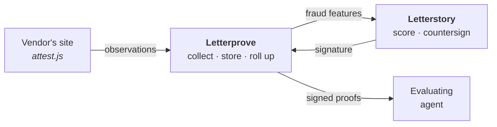

<div align="center">

<picture>
  <source media="(prefers-color-scheme: dark)" srcset="assets/logo-dark.svg">
  
</picture>

<br>

**Attested proof for AI agents.** &nbsp;·&nbsp; The "EEAT" for AEO.

</div>

---

A human evaluating software might skim three tabs. An agent evaluates thirty
products, reads every claim, checks every source, and discounts for vendor bias.
Discovery gets a product on the shortlist. **Proof gets it picked.**

Letterprove turns a vendor's logo wall — a page of unverifiable claims — into
signed, machine-readable attestations that an agent can fetch, verify, and cite.

> [!NOTE]
> **Status: publishing half built, collection not started.** Signing, chaining,
> the proof endpoints and the verifier all work today against fixture data —
> see [Running it](#running-it). Collection is Steve's, and lands against the
> contracts below. Every decision is tagged **Decided**, **Proposed**, or
> **Open**.

---

## The problem

Every logo on a vendor's marketing site is an unverified claim. So is every
testimonial, every case-study PDF, and every "trusted by 500 teams." A human
discounts them automatically. An agent does too — and unlike the human, it will
go looking for something better.

There is currently no way for a vendor to say *"Acme is a real customer, active
since 2023, running SSO and the API, 4,182 sessions last month"* in a form an
evaluating agent can check rather than take on faith.

## What Letterprove does

| | | |
|---|---|---|
| **01** | **Install** | One script tag on the vendor's site. No SDK, no backend, no data warehouse. It begins observing real product usage the moment it loads. |
| **02** | **Verify** | Letterprove confirms the vendor's headline customers actually use the product — real accounts, real activity — and records each observation with facts the vendor cannot forge. |
| **03** | **Attest** | We publish dynamic, machine-readable customer success reports that agents can fetch, verify, and quote. Always current, always signed. |

```html
<script src="https://cdn.letterprove.com/attest.js" data-key="lp_live_9f2c…"></script>
```

---

## The trust model

This is the part that decides whether the product is real, so it goes first.

The script runs on **the vendor's own site**. Everything it reports originates,
at root, from the party who benefits from it looking good. A Letterprove
signature proves *we observed this*. It does not, by itself, prove *this is
true*. Those are different claims and the JSON must never blur them.

We treat that as a feature. Every claim carries a **provenance tier**, so an
agent can weigh it instead of trusting it:

| Tier | Source | Forgeable by the vendor? |
|:---:|---|---|
| **0** | Vendor-asserted — the ordinary logo wall | Trivially |
| **1** | Observed by our script in a real browser | With effort |
| **2** | Bound to infrastructure facts the vendor doesn't control | Hard |
| **3** | Corroborated by a third party — Stripe, IdP, DNS | No |
| **4** | Counter-signed by the customer themselves | No |

**Tier 2 is the phase-one target.** The vendor can fabricate a payload, but not
our server's receipt timestamp, not the observed origin, and not the ASN a
request arrived from. Binding vendor-supplied facts to infrastructure-derived
facts raises the cost of faking a month of usage from *editing a JSON file* to
*running a distributed spoofing rig* — a real jump, and an auditable one.

**Tier 3 is where `"verified": true` becomes fully honest**, because payment and
identity-provider data never passes through the vendor's hands. That arrives
with Stripe in phase three.

Rigor compounds. Ship tier 1–2, design the schema for 3–4, and never print the
word *verified* where the tier doesn't earn it.

---

## Architecture

Letterprove is **its own service, its own repo, its own deploy**. It owns
everything specific to attestation. Letterstory is a deliberately thin trunk
holding only what is genuinely cross-service.

The organizing rule: **service-level concerns live in the service; the trunk
coordinates.** Letterstory already carries a lot, and every Letterprove concern
pushed into it is coordination overhead that compounds as both grow. Leaves stay
fat and autonomous, the trunk stays minimal and agile.



| Trunk — **Letterstory** | Leaf — **Letterprove** |
|---|---|
| Staff identity / SSO | Vendors, their customers, consent state |
| Anti-fraud scoring **+ the signing key** | Signal registry, per-vendor collection config |
| Billing and entitlements | The script, collector, storage, rollups |
| Cross-product customer record | Publishing, endpoints, proof surfaces |

Four things in the trunk, all genuinely cross-service.

### Identity

Letterprove stands up its **own** vendor, customer, and org model rather than
borrowing Letterstory's — and this is more necessary than it looks. Consent has
no Letterstory analogue: when Acme approves their own attestation, that is the
vendor's customer, someone who will never hold a Letterstory account. Modelling
them in the trunk would be genuinely wrong.

- **Letterprove owns outright** — vendors, their customers, consent state,
  publishable keys.
- **Letterstory federates in** — staff access only. One SSO hop.

End-customer orgs are never synced between the two. Two identity systems trying
to mirror each other is the worst of both.

### Open code, closed data

Letterprove's computation is **open source**, and that is a product decision
rather than housekeeping. The premise of the whole system is *don't take our
word for it* — an agent that can read the code that produced a claim is in a
categorically better position than one that can only check a signature.

So every attestation carries a `method` pointer: repo, path, and commit SHA of
the rollup logic that computed it. **The attestation cites the code that made
it.**

The inverse holds just as firmly. Open source is not open data — the
observations Letterprove stores are never public. And **anti-fraud stays
closed**, in Letterstory, because published detection logic is an evasion
manual.

### The signing seam

One capability does not move to the leaf: **the authority to say "this is
true."**

```
Letterprove computes a snapshot
  → Letterstory scores it for fraud and countersigns
    → Letterprove publishes
```

This is what makes the fraud check load-bearing instead of advisory. If
Letterprove held the key, Letterstory's scoring would be a report nobody is
obliged to obey, and a single compromise would mint arbitrary valid proofs.
The leaf is autonomous for everything except the one irreversible act.

### The test that keeps this honest

Two services that must deploy together are not two services. The check:

> **Letterprove can ship a new signal, a new rollup, or a new endpoint without
> Letterstory moving.**

Countersigning is a runtime call, not a build dependency, so this holds. If a
change ever requires a coordinated deploy, the boundary has drifted and the
fix belongs here, not in a release plan.

---

## Collection

### The one hard rule: domain only

> [!IMPORTANT]
> The script sends the **domain part of an account identity and nothing else**.
> `acme.com`, never `john@acme.com`.

The domain does the entire job of attributing activity to a customer. The local
part does no additional work and carries every downside: end-user PII from
someone else's product, a DPA with every vendor, GDPR surface, and a breach
story. It never leaves the browser.

The same discipline applies throughout — no user ids, no cookies, no IP in the
payload, no raw referrer. A visit is a row of facts, not a person. This is a
constraint, not an oversight, and it is what keeps collection outside consent
territory on the end-user side.

### Identity resolution — **Decided**

Account identity is **inferred from the email domain**, automatically, with no
vendor integration work. Inference *proposes*; **the alias map decides.**

Letterprove holds a domain→account alias list per customer, because inference
alone is wrong in three predictable ways, and a wrong answer here is not a
missing row — it is a signed attestation that is false:

- **Free-mail addresses** (`gmail.com`, `outlook.com`) map to no company. They
  need an explicit list and an *unattributable* bucket, or those sessions
  silently vanish from the counts.
- **One company, many domains** — `acme.com`, `acme.co.uk`, `acmecorp.com`, plus
  acquisitions. Naive inference splits one customer into five, each too small to
  attest. (Lettertrace solved this shape already: `brand_domains text[]`,
  index 0 = primary.)
- **Contractors and agencies** — `someone@consultancy.com` working inside Acme's
  tenant is attributed to Consultancy. This is the case that publishes something
  false, and the only defense is a human-correctable mapping.

Because the mapping is service-local data, fixing any of these is a row edit —
never a vendor redeploy, and never a cross-repo coordination.

### Event schema — **Proposed**

Two events, not a general analytics firehose. The firehose is what turns this
into a six-month schema debate.

```jsonc
POST /v1/observe          // sendBeacon-safe, key-scoped, origin-pinned
{
  "k":      "lp_live_…",  // publishable key
  "domain": "acme.com",   // the join key — domain only, always
  "ev":     "session",    // session | signup | login | feature
  "feat":   "sso",        // only when ev=feature
  "cfg":    7,            // config version that produced this event
  "ts":     1754870400
}
```

The client sends facts. **All counting happens server-side** — never trust a
counter the page could inflate.

Each observation is stored bound to facts the client did not supply: our receipt
timestamp, the request origin, and the originating ASN. ASN matters more than
geography for fraud detection — *"all 4,182 sessions came from one AWS range"*
is the tell that catches a spoofing rig, and country-level geo never would.

For tier 2 server-side reporting, a parallel `POST /v1/ingest` from the vendor's
backend, HMAC-signed with a replay nonce.

### Configuration — **Decided**

The script pulls its collection config from Letterprove at boot. Signals change
without shipping new script and without a vendor ever re-pulling.

- **Fails closed.** No config, no collection. Never blocks page render.
- **Cached last-known** with a TTL, so a service blip doesn't blind the fleet.
- **Public by nature.** It ships to a browser; anyone can read what a vendor
  collects. No secrets in it, ever.
- **Versioned.** Every event carries its `cfg` version, or a mid-month schema
  change makes the rollup uninterpretable after the fact.

### Reliability

Telemetry must never break a host page — every path wrapped, every failure
silent. And because collection spans a third party's page, a CDN, and our
collector, **the script's response carries a diagnostic header**
(`x-letterprove: on | off`) from day one. Whether a vendor is reporting should
be answerable with one `curl`, not an afternoon. Configuration bugs across a
distributed install look exactly like broken code; this is what makes them
visible.

---

## Publication

### Endpoints

| Path | Serves |
|---|---|
| `/proofs/{vendor}` | Human-readable report and machine-readable JSON, content-negotiated |
| `/attest/{vendor}/{customer}.json` | One customer's attestation |
| `/.well-known/letterprove.json` | Discovery |
| `/.well-known/letterprove-jwks.json` | Public signing keys |

Agents evaluating a vendor mostly crawl **the vendor's own domain**, so the
script also injects JSON-LD into the vendor's page, and vendors may proxy
`vendor.com/proofs/*` to us. Same-origin proof is what gets cited.

### Shape

```json
{
  "customer": "Acme Corp",
  "verified": true,
  "tier": 2,
  "since": "2023-03",
  "features": ["sso", "api", "analytics"],
  "sessions_30d": 4182,
  "seats_active": 148,
  "observed_through": "2026-08-10T00:00:00Z",
  "published_at": "2026-08-10T00:07:00Z",
  "ttl": 3600,
  "key_id": "lp-2026-08",
  "prev_hash": "…",
  "method": "https://github.com/letterstory/Letterprove/blob/a1b2c3d/src/rollup/sessions.ts",
  "signature": "att_9f2c14…"
}
```

`method` is a commit-pinned link to the open-source logic that produced these
numbers. An agent — or a competitor, or a customer — can read exactly how the
count was reached. Nothing else in the file asks to be trusted.

### Freshness

Signing happens on a cadence, not per request. Three tiers of data:

- **Hot** — raw events, minutes old, unsigned. What the team sees internally.
- **Rolled up** — hourly aggregates per account × feature. What the charts read.
- **Published** — immutable signed snapshots carrying `observed_through`,
  `published_at`, and `ttl`.

*"Last attested 2m ago"* comes from publishing frequently, not from signing
on the fly.

### Signing — **Proposed**

Ed25519, countersigned by Letterstory as described in [the signing
seam](#the-signing-seam). The private key lives in Letterstory's server
environment — never in this repo, never client-reachable, never held by the
service that computes the numbers. Public keys are published at the JWKS
endpoint, and **every signature carries a `key_id`**.

Rotation is additive: mint the new key, sign with it, and **keep old public keys
published forever** so previously issued proofs still verify. That last part is
free to build now and painful to retrofit.

Each snapshot carries `prev_hash`, chaining it to its predecessor. That is what
upgrades the system from *signed* to *auditable* — we cannot quietly rewrite
last quarter's numbers, and an agent or a skeptical competitor can prove it.

Per-vendor keys and customer counter-signing (tier 4) are additive later,
precisely because `key_id` is there from day one.

---

## Published vs. retained

Not everything observed is published, and the most sensitive fields are never
published at all.

| | Published | Retained internally |
|---|---|---|
| **Contents** | Counts, tiers, windows, features, `(domain, origin, receipt_ts, coarse_geo, cfg, key_id)` | Salted per-user hashes, ASN, raw observations |
| **Purpose** | What an agent reads and cites | Counting distinct humans, detecting fabrication |
| **Retention** | Indefinite, immutable, chained | Short TTL |

The internal record is enough to prove distinctness and catch a spoofing rig.
It is never enough to name a person, and it never appears in public JSON.

**All of it stays in Letterprove.** Letterstory holds no Letterprove data — it
holds judgment. Fraud scoring runs on a feature stream the service pushes
(ASN distributions, per-domain distinct-hash counts, timing shape), not on a
copy of the observations. The leaf keeps its data whole; the trunk stays small.

---

## Signal roadmap

| Phase | Signals | Tier | Notes |
|:---:|---|:---:|---|
| **1** | Signups, logins, sessions, active accounts | 1–2 | Script only. Enough for *verified customer, active since, sessions/mo*. |
| **2** | Feature adoption, seats | 2 | Named events from config. Fills the feature-level proof matrix. |
| **3** | Payments — Stripe Connect, read-only | 3 | First claim that escapes vendor origination entirely. Contract value, tenure, renewal. |
| **4** | Retention, ROI, expansion | 3–4 | Most valuable, hardest. Needs customer counter-signing to be credible. |

---

## Consent

Publishing *"Acme runs SSO, 148 seats, 92% adoption"* discloses **Acme's** data.
Acme is our customer's customer.

**Proposed approach — build for named, ship anonymized, flip as consent lands.**
Aggregate proof (*"12 attested customers, 4 features proven, 38k sessions/mo"*)
carries almost no consent problem and is already meaningfully better than a logo
wall. Named attestation is the part that needs Acme's say-so. This unblocks the
entire pipeline today while the legal question runs in parallel.

Design the consent step as the verification step: a customer who approves their
own attestation has just produced a tier-4 counter-signature, the strongest
proof in the system.

---

## Running it

```bash
nvm use          # Node 22
npm install
npm run dev      # http://localhost:9100
npm test
```

With no signing key configured the service derives a deterministic one from a
published seed, ids it `dev-insecure-…`, and says so on every page and in the
discovery document. Mint a real one with `npm run keygen`.

| Surface | |
|---|---|
| `/` | Index of published proofs |
| `/proofs/vantage` | The report — HTML for a person, JSON for `Accept: application/json` or a `.json` suffix |
| `/attest/vantage/acme-corp.json` | One signed attestation |
| `/attest/vantage/acme-corp/chain` | Its full signed history |
| `/.well-known/letterprove.json` | Discovery |
| `/.well-known/letterprove-jwks.json` | Public keys |

### Verify it yourself

```bash
npm run verify -- http://localhost:9100/attest/vantage/acme-corp/chain
```

`scripts/verify.mjs` shares **no code** with the service. It re-implements
canonicalisation and signature checking from the published description using
only Node built-ins, because a verifier that imports the producer's own
canonicaliser cannot catch the one bug that matters — the producer and the spec
disagreeing. It is also the artifact a sceptical third party should be able to
run without trusting us, so it stays dependency-free and short enough to read.

### What is fixture and what is real

`src/lib/fixtures/vendors.ts` is a fictional vendor. **Vantage does not exist
and nothing it publishes is evidence.** Everything downstream of it — the
rollup, signing, chaining, the endpoints, the JSON-LD, the verifier — is the
production path. When telemetry lands, only the input to `bodiesFor` changes.

The `countersign` seam in `src/lib/attest/countersign.ts` signs locally for now
and carries the function signature the Letterstory RPC will have.

## Decision log

| # | Question | Status |
|:---:|---|---|
| 1 | Account identity — infer from domain, Letterprove holds the alias override | ✅ **Decided** |
| 2 | Script pulls collection config from Letterprove | ✅ **Decided** |
| 3 | **Microservice split** — Letterprove owns storage, rollups, config and publishing; Letterstory is a minimal coordination trunk | ✅ **Decided** |
| 4 | Domain only — the email local part never leaves the browser | ✅ **Decided** |
| 5 | Provenance tier on every claim; identity hashed and retained, not published | ✅ **Decided** |
| 6 | Letterprove owns its own vendor/customer/consent model; Letterstory federates staff only | ✅ **Decided** |
| 7 | Open computation, closed anti-fraud; attestations carry a commit-pinned `method` | 🟡 Proposed |
| 8 | Letterstory countersigns after fraud scoring — the key never moves to the leaf | 🟡 Proposed |
| 9 | Consent — build named, ship anonymized | 🟡 Proposed |
| 10 | Event schema and config endpoint shapes | 🟡 Proposed |

### Open

- **Does a standard MSA marketing/reference clause cover a continuously
  updating, machine-readable usage attestation, or is that a new grant?** The
  narrow legal question worth asking. Not *"is GDPR ok with this"* — that's a
  month; this is twenty minutes.
- **Phase-1 signal list**, confirmed in writing: signups, logins, sessions,
  active accounts. Nothing else.

---

<sub>A product of The Letter Company.</sub>
